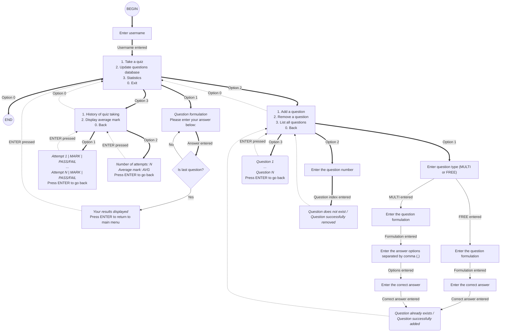

# 1. Command Line User Interface Flowchart Diagram

# 2. Functional Requirements Demonstration
| Description                                                                                                       | Demo     | Application behaviour                                                                                                                                              |
|-------------------------------------------------------------------------------------------------------------------|-------------------------|--------------------------------------------------------------------------------------------------------------------------------------------------------------------|
| Taking a quiz with 5 questions giving 4 correct answers and 1 incorrect answer |  | Displays the results of the quiz and offers to return to the main menu                                                                                             |
| Adding a free-response question to the database |  | Adds the question to "questions.txt" and returns to the "questions database" menu                                                                                  |
| Show all questions in the databse |  | Displays all questions in the database and offers to return to the "questions database" menu                                                                       |
| Remove a question with index 1 from the databse |  | Displays all available questions, asks for the index of the question to be deleted, deletes the question from the database and returns back to the "questions database" menu | 
| ... | ... | ...                                                                                                                                                                |

# 3. Invalid Inputs and Error Handling
| Description                                                                                                       | Demo     | Application behaviour                                                     |
|-------------------------------------------------------------------------------------------------------------------|-------------------------|---------------------------------------------------------------------------|
| The database files are not found                                                                                  |  | Application starts as normal |
| Taking a quiz when the database is empty                                                                          |  | The quiz is not taken, the results is displayed as _NaN_, application offers to return to the main menu |
| Checking statistics when the user has not taken any tests yet                                                     |  | Empty statistics is displayed, application offers to return to the main menu |
| Removing question that does not exist. Total number of questions is 8. Trying to remove a question with index = 8 |  | Question is not deleted, application returns to the database operations menu |
| ... | ... | ... |
